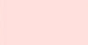

# DISCOVERY ASSIGNMENT 2: *Variable*  

>Variables can be thought of as storage containers for values. These values can change or be changed over time. The purpose of this assignment is to identify objects or concepts in real life that act like variables, and to document their "value" during an interval of time.

>Variables in javascript can hold a variety of value types such as numbers, words, and even colors.

## Assignment

-  Identify an observable variable (in real life) that can be measured by some quantity or quality. This variable should be something you know will change over time (examples: number of dishes in the sink, color tone of the sky, sounds in the air, etc).

- Give this variable a Javascript compliant name (usingCamelCaseLikeThisOfCourse).

- define a set period of time to observe/document the variable (example: between 1PM and 3PM).  

- Create a chart or table in your sketchbook that documents the changing value of the variable.

- Reflect on your findings.

---

## Examples:

<!-- **Describe the variable (the part that changes):** The number of cars in the parking lot

**Describe the article/item/quality that is being measured:** cars

**Name the variable (in a javascript compliant way):** carsInLot

**Describe the measure by which the variable changes:** Time

**Documentation method:** Time-table in my journal

**Actions that might affect the variable value (if any):** Parking my car in the lot or blocking the driveway -->

### fullnessOfCoffeePot:
Variable type: number/percentage

| Time: | Value: |
| ------ | ------- |
| 8:01 am | 0 |
| 8:12 am | 100% |
| 8:16 am | 84% |
| 8:19 am | 66% |
| 8:20 am | 53% |
| 8:25 am | 29% |
| 8:28 am | 0% |

---

### skyColor
Variable type: rgb color

| Time: | Color: | RGB |
| ------- | -------- | --------- |
| 8:03pm |  | color(82, 86, 122) |
| 8:21pm |  | color(153, 172, 209) |
| 8:36pm |  | color(178, 218, 229) |
| 8:50pm |  | color(255, 223, 220) |
| 9:01pm |  | color(240, 191, 197) |
| 9:15pm |  | color(213, 156, 170) |

---

### bodilyState
Variable type: string

| Time: | Bodily state |
| -------- | -------- |
| 8:30 am | "groggy" |
| 9:12 am | "awake" |
| 10:06 am | "sweaty" |
| 10:42 am | "overheating" |
| 11:09 am | "cooling off" |
| 12:35 pm | "full" |
| 1:01 pm | "relaxed" |
