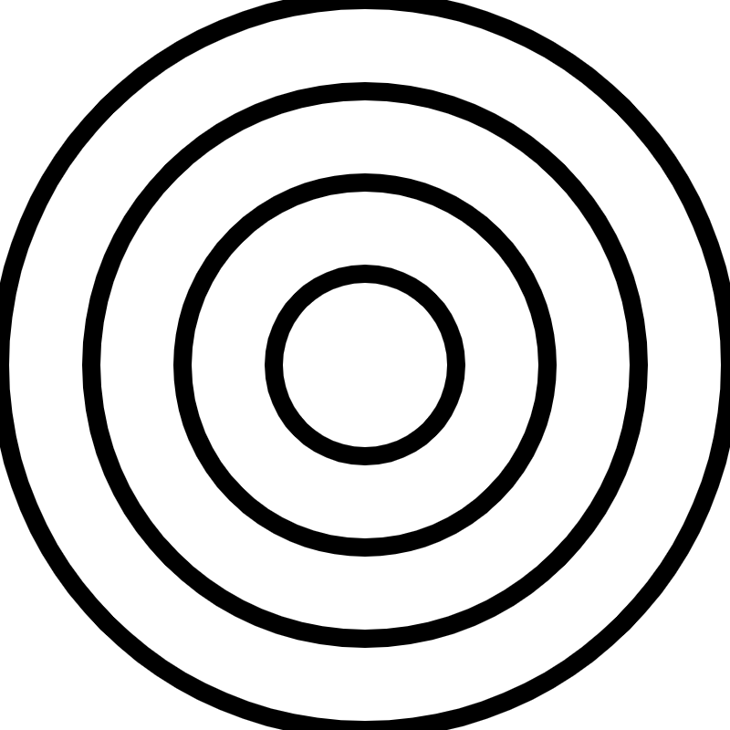
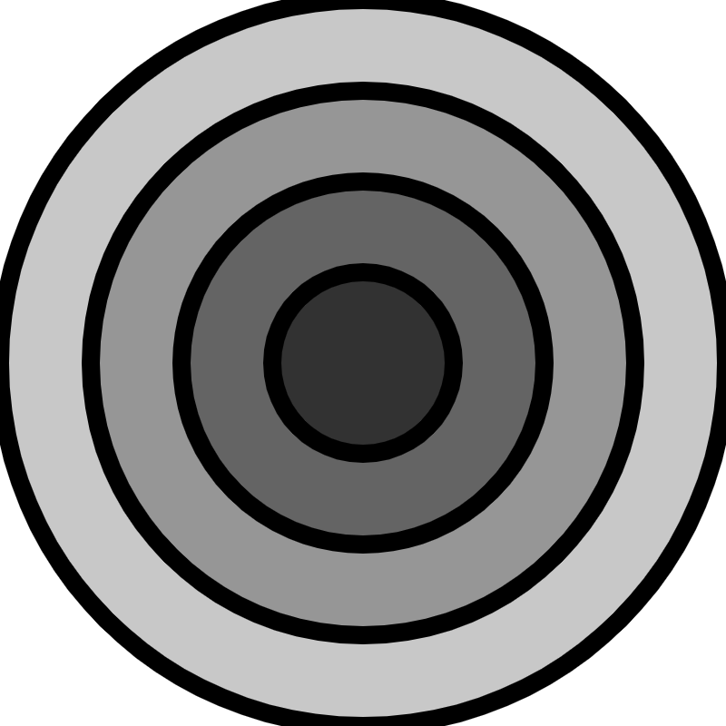
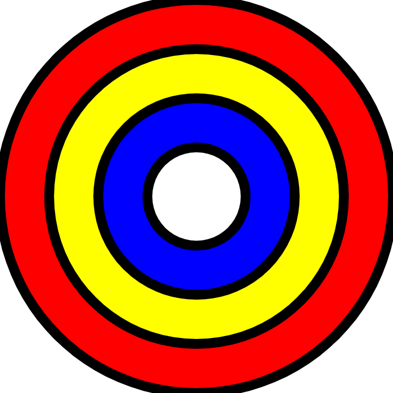
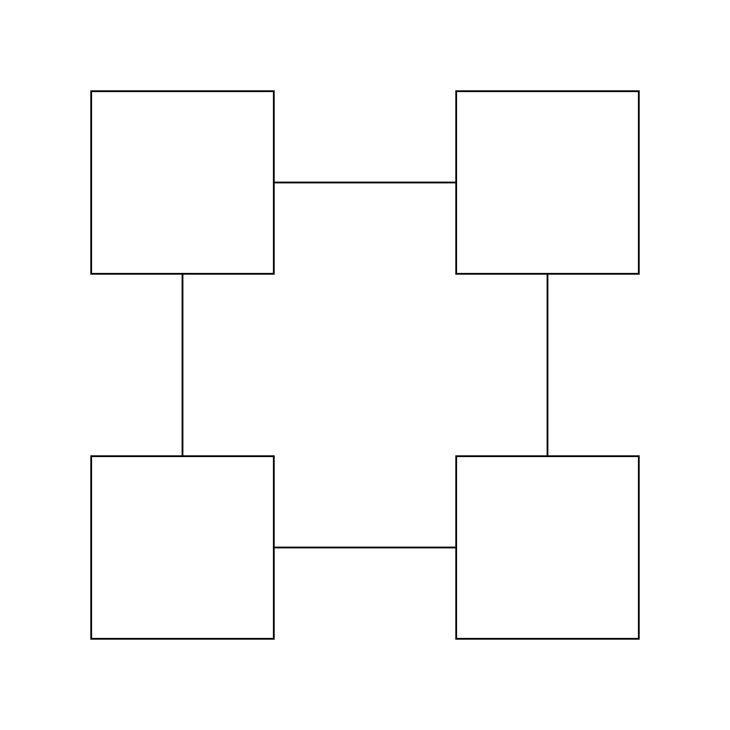
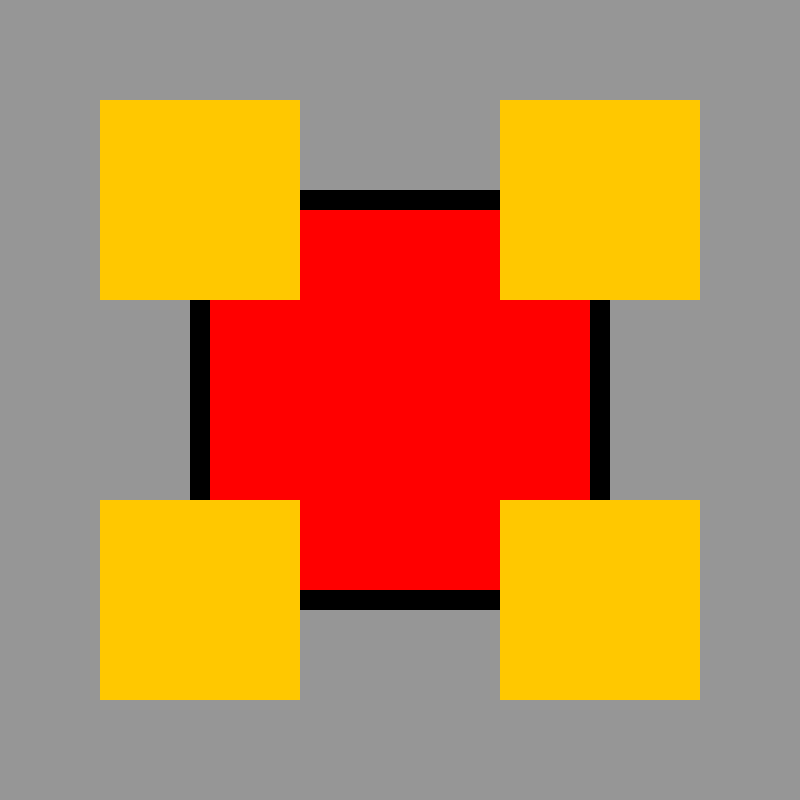
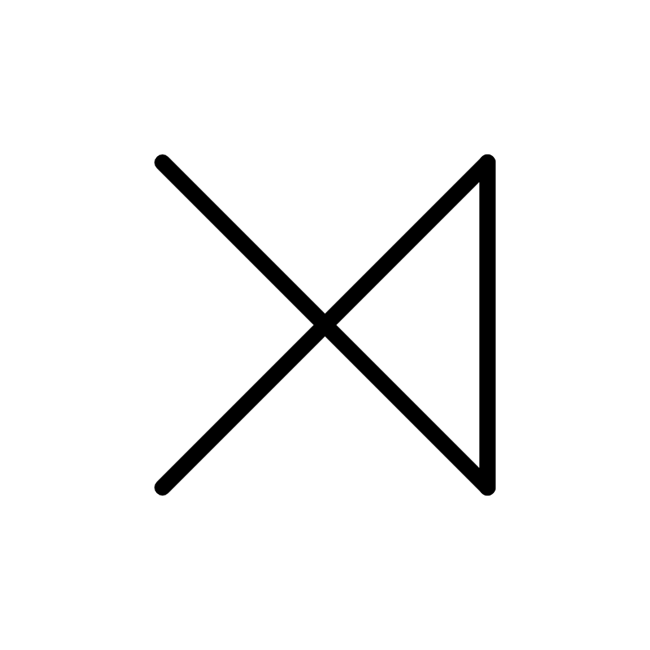
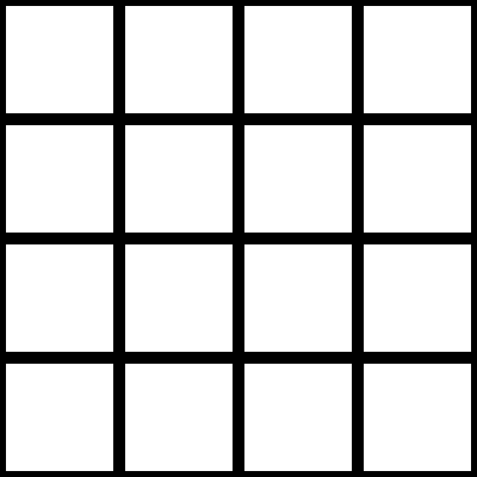
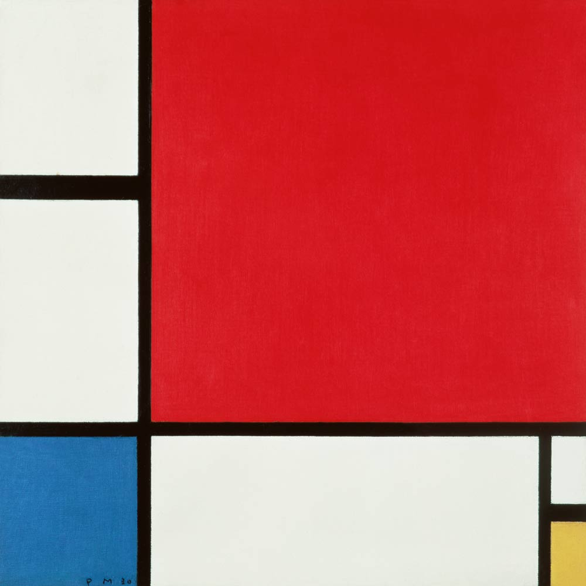
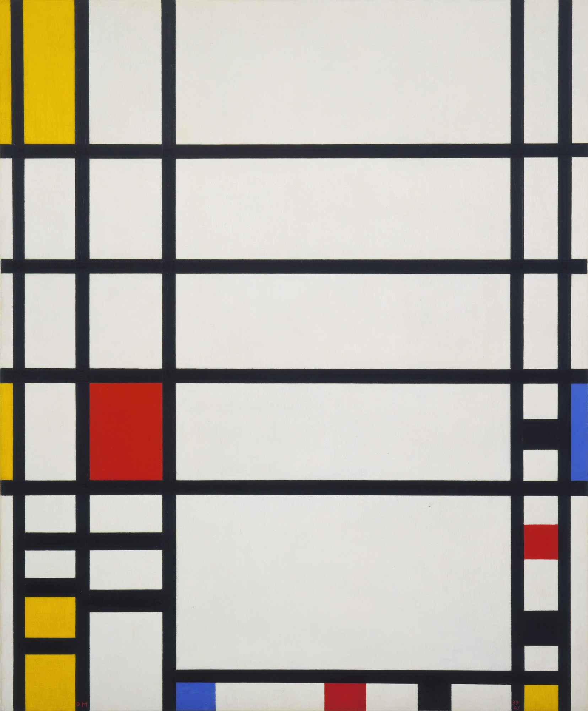
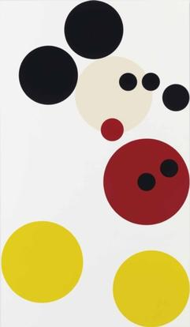

# Day 1

What is creative coding?: "Creative Coding is a method that uses computer programming for artistic expression. In this method, the goal is not predefined and the process is based on discovery, variation, and exploration of mostly unexpected results." 
[Tim Rodenbroeker](https://timrodenbroeker.de/what-is-creative-coding/)

The coding environement that we will be using is the p5 editor. The editor is hosted on the web at <https://editor.p5js.org>.

The p5 library for javascript has many useful functions. The entire of list functions can be found in the p5 reference, along with information about what each function does and how it can be used. The reference can be found here: <https://p5js.org/reference/>

## Basic rules

uppercase and lowercase matters.

all opening brackets must have a closing bracket

command endings are semicolon (;)

## Anatomy of a p5 sketch

The two main elements of a sketch are the setup function and the draw function (also referred to as the draw loop)

The setup function is executed only once at the beginning of the program, while the draw function is executed repeatedly.

preceeding lines with two forward slashes (//) removes the entire line from executing, thereby serving as a way to put comments into the code

## Canvas coordinates

The canvas is the main element to which lines shapes and colors are drawn to. The size of the canvas is determined within the createCanvas function using two values, one for the width and one for the height, the size is expressed as pixels on the screen.

The coordinate system's origin is at the top left corner of the canvas. Moving to the right from the origin is the positive X direction and moving downward or vertically from the origin is the positive Y direction

## drawing shapes and lines

Standard shapes and basic lines are drawn to the canvas using special functions that are part of the p5 library.

Each function is called by writing the function name, followed by a pair of parenthasis. The arguments of the function are passed into the parenthesis as parameters. The order of the values is important and the correct order can be known by reading the p5 reference sheet.

The order in which the functions are written determine the order in which they are drawn to the screen. If a circle function is used before a square function, then the circle will be drawn first and the square second. In other words, order matters a great deal.

By default, squares and rectangles are drawn to the screen using the CORNERS mode. a more intuitive way of working with them is to use the CENTER mode. These modes determine whether the first and second parameter in the function call will be the location of the center of the shape, or The mode can be changed using to use the first and second parameters as the location of the square's top left corner

## using fill color

Color is a deep topic that warrants it's own course. In the most simplest sense, color can be set for shapes, lines, outlines, and text, as well as a variety of other elements by using the RGB color mode, which is the default color mode in p5. Alternate color modes are HSB and HSL. For the rgb color mode, three values determine the color using ranges between 0 and 255. The first value is red, the second value is blue, and theird value is green. These values can be put into the fill functionlike this: fill(255, 255, 255) (fills the shape with white), fill(0,0,0) (fills the shape with black), fill(255,0,0) (fills the shape with red).

Using a color picker helps find the good colors.

hex codes can also be used in place of the three parameters.

Using four parameters has the effect of assigning a transparency to the color.

To remove the color altogether, the function noFill() (with out any paramters included in the parenthesis) can be used.

## using stroke

Similar to using fill color, the stroke color can be assigned using the stroke() funtion. The stroke function takes the same parameters as the fill function.

Removing the stroke can be achieved using the noStroke() function (with out passing any parameters to it).

The thickness of the outline can be assigned by using the strokeWeight() function and passing a thickness value into the function as a parameter. For example, a shape with a very thick outline could be drawn using the function stroke(10)

# functions we use:

- createCanvas()
- background()
- fill()
- noFill()
- stroke()
- noStroke()
- strokeWeight()
- circle()
- square()
- rect()
- rectMode() (two modes: CENTER and CORNER)
- line()

# Practice Sketches

[Concentric Circles](practiceSketches/circlesConcentric.js)

[Concentric Circles with Gray tones](practiceSketches/circlesConcentricGrayTones.js)

[Circles Multi-color](practiceSketches/circlesMultiColor.js)

[Square With Squares](practiceSketches/rectModeCenter.js)

[Square With Colors](practiceSketches/rectModeCenterColors.js)

[Simple Lines](practiceSketches/lineSimple.js)

[Grid Of Lines](practiceSketches/lineGrid.js)

Mondrian Easy

Mondrian Intermediate

Damian Hirst Mickey Mouse

# On Your Own

explore the beginShape() and endShape() functions that use the vertex command. Find them in the p5 reference sheet and read their descriptions. Make your own custom shapes using them.

Create a simpplified self portrait using shapes, lines, and color. The portrait can be very geometric, or more detailed. 

